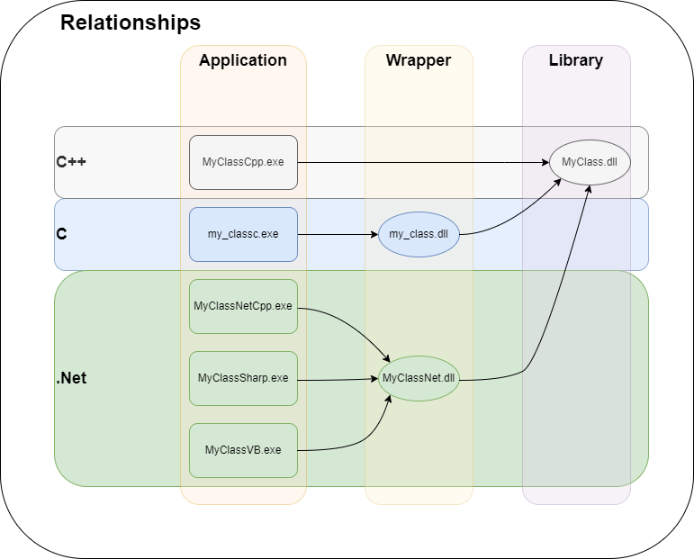

# A C++ Class Library And Wrappers
If you are developing a C++ application, you will naturally create many Classes and use these classes where necessary. In some cases, you will need to transfer the classes you use all the time to other projects. In this case, the best practice would be to compile your C++ class as a library and use it directly in other applications.

If you're going to continue to develop the library but other developers will use it, and other developers need to be able to update their applications without having to recompile, what you need to do is to compile the library as a Shared Library (Dynamic Link Library for Windows DLL for short). Thus, 3 files will appear;

* A header file with class definitions: <name>.h/<name>.hpp
* A library file holding exported class symbols and addresses: <name>.lib
* The extension file that contains the actual working codes and must be distributed with the application: <name>.dll

You add the header file to your source code and start using the class. You compile your class by adding the library file at compile time. Finally, you distribute the DLL file with your application and enable the user to use the application without any problems.

If you have made a minor change, such as a code change in the calculation algorithm of a function, or fixed a bug that will not radically change the structure within the Class, all you have to do is update the DLL file after compilation. Thus, neither other developers have to recompile their code nor users have to download the whole project from scratch.

Everything is so good up to here. But what if other developers are using a different language but not C++. In this case, there are several ways to follow. The safest of these is to write a Wrapper. This scenario will be exemplified in this project with several projects under a single Visual Studio Solution.

Basically we have 3 main projects

* **MyClass:**
In this project, a class will be defined with Native C++ and a DLL will be created as a result. The project will implement and share a class. Thus, anyone who develops applications with C++ will be able to easily add this class to their own projects and use it.

* **my_class:**
This project implements a C Wrapper for the MyClass.dll library. Actually, there is no need for a separate project for C Wrapper. Necessary C implementation could have been done in the previous project. However, different projects have been carried out in order to show which example starts where and where it ends by abstracting the examples.

* **MyClassNet:**
This project implements .Net Wrapper example of MyClass.dll library with C++/CLI .Net. This creates a .Net library called MyClassNet.dll. Whichever .Net language you use, you can use it by adding the MyClassNet.dll library to your project.

In addition, we will have 5 additional projects and we will test on these projects.

* **MyClassCpp:**
This project creates a C++ console application that uses the MyClass.dll library directly. For the application to work, MyClassCpp.exe and MyClass.dll files must be in the same directory or in a location defined in the PATH variable.

* **my_classc:**
This project is a C application that uses the my_class.dll library. The MyClass class is called and used through the wrapper functions implemented in my_class.dll.

* **MyClassNetCpp:**
This project is a C++.Net application that uses the MyClassNet.dll library. The MyClass class is called and used through the wrapper functions implemented in MyClassNet.dll.

* **MyClassNetSharp:**
This project is a C# application that uses the MyClassNet.dll library. The MyClass class is called and used through the wrapper functions implemented in MyClassNet.dll.

* **MyClassNetVB:**
This project is a VB.Net application that uses the MyClassNet.dll library. The MyClass class is called and used through the wrapper functions implemented in MyClassNet.dll.



## MyClass
It is desired to develop a class that is large enough to exemplify the project in a meaningful way, but simple enough not to create confusion. The structure of the class is as follows.

```cpp
class MyClass() {
public:
	MyClass();
	~MyClass();
	
	void setMessage(std::string msg);
	std::string getMessage();
	
	void printMessage();
	
	void setValue(int value);
	int getValue();
	
private:
	std::string _msg;
	int _value;
};
```
