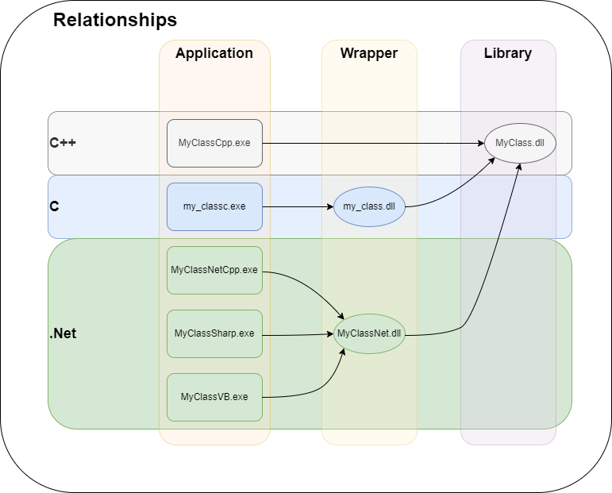

# A C++ Class Library And Wrappers
Eğer bir C++ uygulaması geliştiriyorsanız doğal olarak birçok Sınıf oluşturacak ve bu sınıfları gerekli yerlerde kullanacaksınız. Bazı durumlarda sürekli kullandığınız sınıfları diğer projelere de aktarmanız gerekecektir. Bu durumda en iyi yöntem C++ sınıfınızı bir kütüphane olarak derlemek ve diğer uygulamalarda doğrudan kullanmak olacaktır.

Eğer kütüphaneyi geliştirmeye siz devam edecekseniz fakat diğer geliştiriciler kullanacaksa ve diğer geliştiricilerin uygulamalarını yeniden derlemek zorunda kalmadan güncelleme yapabilmesi gerekiyorsa, yapmanız gereken, kütüphaneyi bir Shared Library (Windows için Dynamic Link Library kısaca DLL) olarak derlemek olacaktır. Böylece ortaya 3 adet dosya çıkacaktır;

* Sınıf tanımlarının bulunduğu bir başlık dosyası: <name>.h/<name>.hpp
* Dışa aktarılmış sınıf sembollerini ve adreslerini tutan bir kütühane dosyası: <name>.lib
* Asıl çalışan kodları barındıran ve uygulama ile dağıtılması gereken uzantı dosyası: <name>.dll

Başlık dosyasını kaynak kodunuza ekler ve sınıfı kullanmaya başlarsınız. Derleme zamanında kütüphane dosyasını ekleyerek sınıfınızı derlersiniz. Son olarak DLL dosyasını uygulamanızla dağıtır ve kullanıcının uygulamayı sorunsuz kullanmasını sağlarsınız.

Eğer Sınıf içerisinde yapıyı kökten değiştirmeyecek, örneğin bir fonksiyonun hesaplama algoritmasında kod değişikliği gibi minör bir değişiklik yaptıysanız ya da bir hata giderdiyseniz tek yapmanız gereken derleme sonrası DLL dosyasını güncellemek olacaktır. Böylece ne diğer geliştiriciler kodlarını yeniden derlemek ne de kullanıcılar tüm projeyi baştan indirmek zorunda kalır.

Buraya kadar herşey çok güzel. Fakat ya diğer geliştiriciler C++ değil de farklı bir dil kullanıyorsa. Bu durumda izlenebilecek birkaç yol var. Bunlardan en güvenlisi bir Sarıcı (Wrapper) yazmaktır. Bu projede tek bir Visual Studio Solution altında birkaç proje ile bu senaryo örneklenecektir.

Temelde 3 ana projemiz bulunmakta

* **MyClass:**
Bu projede Native C++ ile bir sınıf tanımlanacak ve sonucunda bir DLL oluşturulacaktır. Proje, bir sınıfı gerçekleyecek ve paylaşacaktır. Böylece C++ ile uygulama geliştiren herkes rahatlıkla bu sınıfı kendi projelerine ekleyip kullanabilecektir.

* **my_class:**
Bu proje MyClass.dll kütüphanesi için bir C Wrapper implement eder. Aslında C Wrapper için ayrı bir projeye gerek yok. Bir önceki proje içerisinde gerekli C implemantasyonu da yapılabilirdi. Fakat örnekleri soyutlayarak hangi örneğin nereden başlayıp nerede bittiğini gösterebilmek adına farklı projeler yapılmıştır.

* **MyClassNet:**
Bu proje MyClass.dll kütüphanesinin C++.Net ile .Net Wrapper örneğini gerçekler. Bu sayede MyClassNet.dll adında bir .Net kütüphanesi oluşur. Hangi .Net dilini kullanırsanız kullanın projenize MyClassNet.dll kütüphanesini ekleyerek kullanabilirsiniz.

Ayrıca 5 adet ek projemiz olacak ve bu projeler üzerinden test yapacağız

* **MyClassCpp:**
Bu proje doğrudan MyClass.dll kütüphanesini kullanan bir C++ konsol uygulaması oluşturur. Uygulamanın çalışması için MyClassCpp.exe ve MyClass.dll dosyalarının aynı dizinde veya PATH değişkeni içerisinde tanımlanmış bir konumda bulunması gerekir.

* **my_classc:**
Bu proje my_class.dll kütüphanesini kullanan bir C uygulamasıdır. my_class.dll içerisinde gerçeklenen wrapper fonksiyonları aracılığı ile MyClass sınıfı çağırılır ve kullanılır.

* **MyClassNetCpp:**
Bu proje MyClassNet.dll kütüphanesini kullanan bir C++.Net uygulamasıdır. MyClassNet.dll içerisinde gerçeklenen wrapper fonksiyonları aracılığı ile MyClass sınıfı çağırılır ve kullanılır.

* **MyClassNetSharp:**
Bu proje MyClassNet.dll kütüphanesini kullanan bir C# uygulamasıdır. MyClassNet.dll içerisinde gerçeklenen wrapper fonksiyonları aracılığı ile MyClass sınıfı çağırılır ve kullanılır.

* **MyClassNetVB:**
Bu proje MyClassNet.dll kütüphanesini kullanan bir VB.Net uygulamasıdır. MyClassNet.dll içerisinde gerçeklenen wrapper fonksiyonları aracılığı ile MyClass sınıfı çağırılır ve kullanılır.



## MyClass
Projeyi anlamlı bir şekilde örnekleyebilecek kadar geniş fakat kafa karışıklığı oluşturmayacak kadar sade bir sınıf geliştirilmek istenmiştir. Sınıfın yapısı aşağıdaki gibidir.

```cpp
class MyClass() {
public:
	MyClass();
	~MyClass();
	
	void setMessage(std::string msg);
	std::string getMessage();
	
	void printMessage();
	
	void setValue(int value);
	int getValue();
	
private:
	std::string _msg;
	int _value;
};
```
